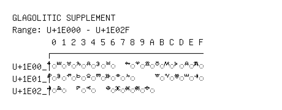

# Glagolitic Supplement

**Range:** `U+1E000` - `U+1E02F`

[← Back to Index](../README.md)

```text
        0 1 2 3 4 5 6 7 8 9 A B C D E F
       ┌───────────────────────────────
U+1E00_│◌𞀀 ◌𞀁 ◌𞀂 ◌𞀃 ◌𞀄 ◌𞀅 ◌𞀆   ◌𞀈 ◌𞀉 ◌𞀊 ◌𞀋 ◌𞀌 ◌𞀍 ◌𞀎 ◌𞀏
U+1E01_│◌𞀐 ◌𞀑 ◌𞀒 ◌𞀓 ◌𞀔 ◌𞀕 ◌𞀖 ◌𞀗 ◌𞀘     ◌𞀛 ◌𞀜 ◌𞀝 ◌𞀞 ◌𞀟
U+1E02_│◌𞀠 ◌𞀡   ◌𞀣 ◌𞀤   ◌𞀦 ◌𞀧 ◌𞀨 ◌𞀩 ◌𞀪
```

## Visual Fallback Reference
If your system lacks the required fonts to render these characters properly, use the image below as a visual guide.


