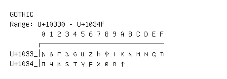

# Gothic

**Range:** `U+10330` - `U+1034F`

[← Back to Index](../README.md)

```text
        0 1 2 3 4 5 6 7 8 9 A B C D E F
       ┌───────────────────────────────
U+1033_│𐌰 𐌱 𐌲 𐌳 𐌴 𐌵 𐌶 𐌷 𐌸 𐌹 𐌺 𐌻 𐌼 𐌽 𐌾 𐌿
U+1034_│𐍀 𐍁 𐍂 𐍃 𐍄 𐍅 𐍆 𐍇 𐍈 𐍉 𐍊
```

## Visual Fallback Reference
If your system lacks the required fonts to render these characters properly, use the image below as a visual guide.


