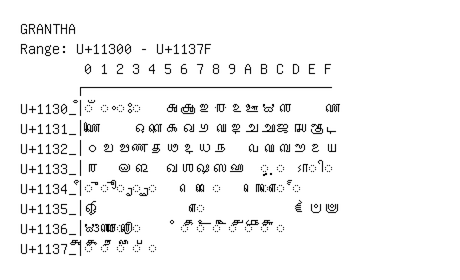

# Grantha

**Range:** `U+11300` - `U+1137F`

[← Back to Index](../README.md)

```text
        0 1 2 3 4 5 6 7 8 9 A B C D E F
       ┌───────────────────────────────
U+1130_│◌𑌀 ◌𑌁 ◌𑌂 ◌𑌃   𑌅 𑌆 𑌇 𑌈 𑌉 𑌊 𑌋 𑌌     𑌏
U+1131_│𑌐     𑌓 𑌔 𑌕 𑌖 𑌗 𑌘 𑌙 𑌚 𑌛 𑌜 𑌝 𑌞 𑌟
U+1132_│𑌠 𑌡 𑌢 𑌣 𑌤 𑌥 𑌦 𑌧 𑌨   𑌪 𑌫 𑌬 𑌭 𑌮 𑌯
U+1133_│𑌰   𑌲 𑌳   𑌵 𑌶 𑌷 𑌸 𑌹   ◌𑌻 ◌𑌼 𑌽 ◌𑌾 ◌𑌿
U+1134_│◌𑍀 ◌𑍁 ◌𑍂 ◌𑍃 ◌𑍄     ◌𑍇 ◌𑍈     ◌𑍋 ◌𑍌 ◌𑍍
U+1135_│𑍐             ◌𑍗           𑍝 𑍞 𑍟
U+1136_│𑍠 𑍡 ◌𑍢 ◌𑍣     ◌𑍦 ◌𑍧 ◌𑍨 ◌𑍩 ◌𑍪 ◌𑍫 ◌𑍬
U+1137_│◌𑍰 ◌𑍱 ◌𑍲 ◌𑍳 ◌𑍴
```

## Visual Fallback Reference
If your system lacks the required fonts to render these characters properly, use the image below as a visual guide.


