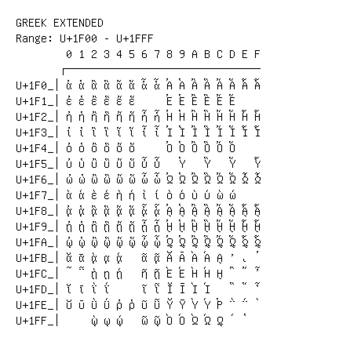

# Greek Extended

**Range:** `U+1F00` - `U+1FFF`

[← Back to Index](../README.md)

```text
        0 1 2 3 4 5 6 7 8 9 A B C D E F
       ┌───────────────────────────────
U+1F0_│ἀ ἁ ἂ ἃ ἄ ἅ ἆ ἇ Ἀ Ἁ Ἂ Ἃ Ἄ Ἅ Ἆ Ἇ
U+1F1_│ἐ ἑ ἒ ἓ ἔ ἕ     Ἐ Ἑ Ἒ Ἓ Ἔ Ἕ
U+1F2_│ἠ ἡ ἢ ἣ ἤ ἥ ἦ ἧ Ἠ Ἡ Ἢ Ἣ Ἤ Ἥ Ἦ Ἧ
U+1F3_│ἰ ἱ ἲ ἳ ἴ ἵ ἶ ἷ Ἰ Ἱ Ἲ Ἳ Ἴ Ἵ Ἶ Ἷ
U+1F4_│ὀ ὁ ὂ ὃ ὄ ὅ     Ὀ Ὁ Ὂ Ὃ Ὄ Ὅ
U+1F5_│ὐ ὑ ὒ ὓ ὔ ὕ ὖ ὗ   Ὑ   Ὓ   Ὕ   Ὗ
U+1F6_│ὠ ὡ ὢ ὣ ὤ ὥ ὦ ὧ Ὠ Ὡ Ὢ Ὣ Ὤ Ὥ Ὦ Ὧ
U+1F7_│ὰ ά ὲ έ ὴ ή ὶ ί ὸ ό ὺ ύ ὼ ώ
U+1F8_│ᾀ ᾁ ᾂ ᾃ ᾄ ᾅ ᾆ ᾇ ᾈ ᾉ ᾊ ᾋ ᾌ ᾍ ᾎ ᾏ
U+1F9_│ᾐ ᾑ ᾒ ᾓ ᾔ ᾕ ᾖ ᾗ ᾘ ᾙ ᾚ ᾛ ᾜ ᾝ ᾞ ᾟ
U+1FA_│ᾠ ᾡ ᾢ ᾣ ᾤ ᾥ ᾦ ᾧ ᾨ ᾩ ᾪ ᾫ ᾬ ᾭ ᾮ ᾯ
U+1FB_│ᾰ ᾱ ᾲ ᾳ ᾴ   ᾶ ᾷ Ᾰ Ᾱ Ὰ Ά ᾼ ᾽ ι ᾿
U+1FC_│῀ ῁ ῂ ῃ ῄ   ῆ ῇ Ὲ Έ Ὴ Ή ῌ ῍ ῎ ῏
U+1FD_│ῐ ῑ ῒ ΐ     ῖ ῗ Ῐ Ῑ Ὶ Ί   ῝ ῞ ῟
U+1FE_│ῠ ῡ ῢ ΰ ῤ ῥ ῦ ῧ Ῠ Ῡ Ὺ Ύ Ῥ ῭ ΅ `
U+1FF_│    ῲ ῳ ῴ   ῶ ῷ Ὸ Ό Ὼ Ώ ῼ ´ ῾
```

## Visual Fallback Reference
If your system lacks the required fonts to render these characters properly, use the image below as a visual guide.


