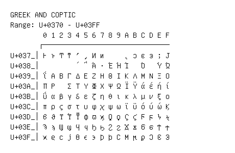

# Greek and Coptic

**Range:** `U+0370` - `U+03FF`

[← Back to Index](../README.md)

```text
        0 1 2 3 4 5 6 7 8 9 A B C D E F
       ┌───────────────────────────────
U+037_│Ͱ ͱ Ͳ ͳ ʹ ͵ Ͷ ͷ     ͺ ͻ ͼ ͽ ; Ϳ
U+038_│        ΄ ΅ Ά · Έ Ή Ί   Ό   Ύ Ώ
U+039_│ΐ Α Β Γ Δ Ε Ζ Η Θ Ι Κ Λ Μ Ν Ξ Ο
U+03A_│Π Ρ   Σ Τ Υ Φ Χ Ψ Ω Ϊ Ϋ ά έ ή ί
U+03B_│ΰ α β γ δ ε ζ η θ ι κ λ μ ν ξ ο
U+03C_│π ρ ς σ τ υ φ χ ψ ω ϊ ϋ ό ύ ώ Ϗ
U+03D_│ϐ ϑ ϒ ϓ ϔ ϕ ϖ ϗ Ϙ ϙ Ϛ ϛ Ϝ ϝ Ϟ ϟ
U+03E_│Ϡ ϡ Ϣ ϣ Ϥ ϥ Ϧ ϧ Ϩ ϩ Ϫ ϫ Ϭ ϭ Ϯ ϯ
U+03F_│ϰ ϱ ϲ ϳ ϴ ϵ ϶ Ϸ ϸ Ϲ Ϻ ϻ ϼ Ͻ Ͼ Ͽ
```

## Visual Fallback Reference
If your system lacks the required fonts to render these characters properly, use the image below as a visual guide.


