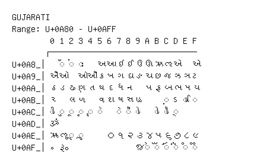

# Gujarati

**Range:** `U+0A80` - `U+0AFF`

[← Back to Index](../README.md)

```text
        0 1 2 3 4 5 6 7 8 9 A B C D E F
       ┌───────────────────────────────
U+0A8_│  ◌ઁ ◌ં ◌ઃ   અ આ ઇ ઈ ઉ ઊ ઋ ઌ ઍ   એ
U+0A9_│ઐ ઑ   ઓ ઔ ક ખ ગ ઘ ઙ ચ છ જ ઝ ઞ ટ
U+0AA_│ઠ ડ ઢ ણ ત થ દ ધ ન   પ ફ બ ભ મ ય
U+0AB_│ર   લ ળ   વ શ ષ સ હ     ◌઼ ઽ ◌ા ◌િ
U+0AC_│◌ી ◌ુ ◌ૂ ◌ૃ ◌ૄ ◌ૅ   ◌ે ◌ૈ ◌ૉ   ◌ો ◌ૌ ◌્
U+0AD_│ૐ
U+0AE_│ૠ ૡ ◌ૢ ◌ૣ     ૦ ૧ ૨ ૩ ૪ ૫ ૬ ૭ ૮ ૯
U+0AF_│૰ ૱               ૹ ◌ૺ ◌ૻ ◌ૼ ◌૽ ◌૾ ◌૿
```

## Visual Fallback Reference
If your system lacks the required fonts to render these characters properly, use the image below as a visual guide.


