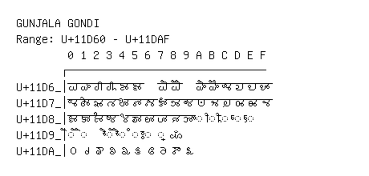

# Gunjala Gondi

**Range:** `U+11D60` - `U+11DAF`

[← Back to Index](../README.md)

```text
        0 1 2 3 4 5 6 7 8 9 A B C D E F
       ┌───────────────────────────────
U+11D6_│𑵠 𑵡 𑵢 𑵣 𑵤 𑵥   𑵧 𑵨   𑵪 𑵫 𑵬 𑵭 𑵮 𑵯
U+11D7_│𑵰 𑵱 𑵲 𑵳 𑵴 𑵵 𑵶 𑵷 𑵸 𑵹 𑵺 𑵻 𑵼 𑵽 𑵾 𑵿
U+11D8_│𑶀 𑶁 𑶂 𑶃 𑶄 𑶅 𑶆 𑶇 𑶈 𑶉 ◌𑶊 ◌𑶋 ◌𑶌 ◌𑶍 ◌𑶎
U+11D9_│◌𑶐 ◌𑶑   ◌𑶓 ◌𑶔 ◌𑶕 ◌𑶖 ◌𑶗 𑶘
U+11DA_│𑶠 𑶡 𑶢 𑶣 𑶤 𑶥 𑶦 𑶧 𑶨 𑶩
```

## Visual Fallback Reference
If your system lacks the required fonts to render these characters properly, use the image below as a visual guide.


