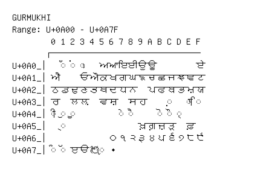

# Gurmukhi

**Range:** `U+0A00` - `U+0A7F`

[← Back to Index](../README.md)

```text
        0 1 2 3 4 5 6 7 8 9 A B C D E F
       ┌───────────────────────────────
U+0A0_│  ◌ਁ ◌ਂ ◌ਃ   ਅ ਆ ਇ ਈ ਉ ਊ         ਏ
U+0A1_│ਐ     ਓ ਔ ਕ ਖ ਗ ਘ ਙ ਚ ਛ ਜ ਝ ਞ ਟ
U+0A2_│ਠ ਡ ਢ ਣ ਤ ਥ ਦ ਧ ਨ   ਪ ਫ ਬ ਭ ਮ ਯ
U+0A3_│ਰ   ਲ ਲ਼   ਵ ਸ਼   ਸ ਹ     ◌਼   ◌ਾ ◌ਿ
U+0A4_│◌ੀ ◌ੁ ◌ੂ         ◌ੇ ◌ੈ     ◌ੋ ◌ੌ ◌੍
U+0A5_│  ◌ੑ               ਖ਼ ਗ਼ ਜ਼ ੜ   ਫ਼
U+0A6_│            ੦ ੧ ੨ ੩ ੪ ੫ ੬ ੭ ੮ ੯
U+0A7_│◌ੰ ◌ੱ ੲ ੳ ੴ ◌ੵ ੶
```

## Visual Fallback Reference
If your system lacks the required fonts to render these characters properly, use the image below as a visual guide.


