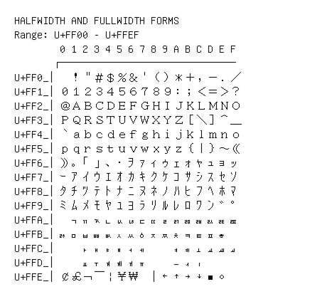

# Halfwidth and Fullwidth Forms

**Range:** `U+FF00` - `U+FFEF`

[← Back to Index](../README.md)

```text
        0 1 2 3 4 5 6 7 8 9 A B C D E F
       ┌───────────────────────────────
U+FF0_│  ！＂＃＄％＆＇（）＊＋，－．／
U+FF1_│０１２３４５６７８９：；＜＝＞？
U+FF2_│＠ＡＢＣＤＥＦＧＨＩＪＫＬＭＮＯ
U+FF3_│ＰＱＲＳＴＵＶＷＸＹＺ［＼］＾＿
U+FF4_│｀ａｂｃｄｅｆｇｈｉｊｋｌｍｎｏ
U+FF5_│ｐｑｒｓｔｕｖｗｘｙｚ｛｜｝～｟
U+FF6_│｠｡ ｢ ｣ ､ ･ ｦ ｧ ｨ ｩ ｪ ｫ ｬ ｭ ｮ ｯ
U+FF7_│ｰ ｱ ｲ ｳ ｴ ｵ ｶ ｷ ｸ ｹ ｺ ｻ ｼ ｽ ｾ ｿ
U+FF8_│ﾀ ﾁ ﾂ ﾃ ﾄ ﾅ ﾆ ﾇ ﾈ ﾉ ﾊ ﾋ ﾌ ﾍ ﾎ ﾏ
U+FF9_│ﾐ ﾑ ﾒ ﾓ ﾔ ﾕ ﾖ ﾗ ﾘ ﾙ ﾚ ﾛ ﾜ ﾝ ﾞ ﾟ
U+FFA_│ﾠ ﾡ ﾢ ﾣ ﾤ ﾥ ﾦ ﾧ ﾨ ﾩ ﾪ ﾫ ﾬ ﾭ ﾮ ﾯ
U+FFB_│ﾰ ﾱ ﾲ ﾳ ﾴ ﾵ ﾶ ﾷ ﾸ ﾹ ﾺ ﾻ ﾼ ﾽ ﾾ
U+FFC_│    ￂ ￃ ￄ ￅ ￆ ￇ     ￊ ￋ ￌ ￍ ￎ ￏ
U+FFD_│    ￒ ￓ ￔ ￕ ￖ ￗ     ￚ ￛ ￜ
U+FFE_│￠￡￢￣￤￥￦  ￨ ￩ ￪ ￫ ￬ ￭ ￮
```

## Visual Fallback Reference
If your system lacks the required fonts to render these characters properly, use the image below as a visual guide.


