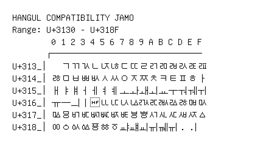

# Hangul Compatibility Jamo

**Range:** `U+3130` - `U+318F`

[← Back to Index](../README.md)

```text
        0 1 2 3 4 5 6 7 8 9 A B C D E F
       ┌───────────────────────────────
U+313_│  ㄱㄲㄳㄴㄵㄶㄷㄸㄹㄺㄻㄼㄽㄾㄿ
U+314_│ㅀㅁㅂㅃㅄㅅㅆㅇㅈㅉㅊㅋㅌㅍㅎㅏ
U+315_│ㅐㅑㅒㅓㅔㅕㅖㅗㅘㅙㅚㅛㅜㅝㅞㅟ
U+316_│ㅠㅡㅢㅣㅤㅥㅦㅧㅨㅩㅪㅫㅬㅭㅮㅯ
U+317_│ㅰㅱㅲㅳㅴㅵㅶㅷㅸㅹㅺㅻㅼㅽㅾㅿ
U+318_│ㆀㆁㆂㆃㆄㆅㆆㆇㆈㆉㆊㆋㆌㆍㆎ
```

## Visual Fallback Reference
If your system lacks the required fonts to render these characters properly, use the image below as a visual guide.


