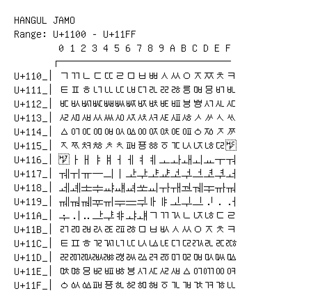

# Hangul Jamo

**Range:** `U+1100` - `U+11FF`

[← Back to Index](../README.md)

```text
        0 1 2 3 4 5 6 7 8 9 A B C D E F
       ┌───────────────────────────────
U+110_│ᄀᄁᄂᄃᄄᄅᄆᄇᄈᄉᄊᄋᄌᄍᄎᄏ
U+111_│ᄐᄑᄒᄓᄔᄕᄖᄗᄘᄙᄚᄛᄜᄝᄞᄟ
U+112_│ᄠᄡᄢᄣᄤᄥᄦᄧᄨᄩᄪᄫᄬᄭᄮᄯ
U+113_│ᄰᄱᄲᄳᄴᄵᄶᄷᄸᄹᄺᄻᄼᄽᄾᄿ
U+114_│ᅀᅁᅂᅃᅄᅅᅆᅇᅈᅉᅊᅋᅌᅍᅎᅏ
U+115_│ᅐᅑᅒᅓᅔᅕᅖᅗᅘᅙᅚᅛᅜᅝᅞᅟ
U+116_│ᅠ ᅡ ᅢ ᅣ ᅤ ᅥ ᅦ ᅧ ᅨ ᅩ ᅪ ᅫ ᅬ ᅭ ᅮ ᅯ
U+117_│ᅰ ᅱ ᅲ ᅳ ᅴ ᅵ ᅶ ᅷ ᅸ ᅹ ᅺ ᅻ ᅼ ᅽ ᅾ ᅿ
U+118_│ᆀ ᆁ ᆂ ᆃ ᆄ ᆅ ᆆ ᆇ ᆈ ᆉ ᆊ ᆋ ᆌ ᆍ ᆎ ᆏ
U+119_│ᆐ ᆑ ᆒ ᆓ ᆔ ᆕ ᆖ ᆗ ᆘ ᆙ ᆚ ᆛ ᆜ ᆝ ᆞ ᆟ
U+11A_│ᆠ ᆡ ᆢ ᆣ ᆤ ᆥ ᆦ ᆧ ᆨ ᆩ ᆪ ᆫ ᆬ ᆭ ᆮ ᆯ
U+11B_│ᆰ ᆱ ᆲ ᆳ ᆴ ᆵ ᆶ ᆷ ᆸ ᆹ ᆺ ᆻ ᆼ ᆽ ᆾ ᆿ
U+11C_│ᇀ ᇁ ᇂ ᇃ ᇄ ᇅ ᇆ ᇇ ᇈ ᇉ ᇊ ᇋ ᇌ ᇍ ᇎ ᇏ
U+11D_│ᇐ ᇑ ᇒ ᇓ ᇔ ᇕ ᇖ ᇗ ᇘ ᇙ ᇚ ᇛ ᇜ ᇝ ᇞ ᇟ
U+11E_│ᇠ ᇡ ᇢ ᇣ ᇤ ᇥ ᇦ ᇧ ᇨ ᇩ ᇪ ᇫ ᇬ ᇭ ᇮ ᇯ
U+11F_│ᇰ ᇱ ᇲ ᇳ ᇴ ᇵ ᇶ ᇷ ᇸ ᇹ ᇺ ᇻ ᇼ ᇽ ᇾ ᇿ
```

## Visual Fallback Reference
If your system lacks the required fonts to render these characters properly, use the image below as a visual guide.


