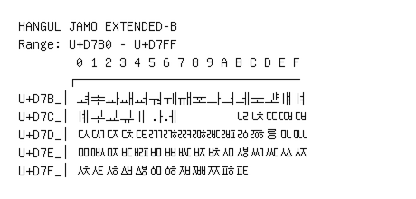

# Hangul Jamo Extended-B

**Range:** `U+D7B0` - `U+D7FF`

[← Back to Index](../README.md)

```text
        0 1 2 3 4 5 6 7 8 9 A B C D E F
       ┌───────────────────────────────
U+D7B_│ힰ ힱ ힲ ힳ ힴ ힵ ힶ ힷ ힸ ힹ ힺ ힻ ힼ ힽ ힾ ힿ
U+D7C_│ퟀ ퟁ ퟂ ퟃ ퟄ ퟅ ퟆ         ퟋ ퟌ ퟍ ퟎ ퟏ
U+D7D_│ퟐ ퟑ ퟒ ퟓ ퟔ ퟕ ퟖ ퟗ ퟘ ퟙ ퟚ ퟛ ퟜ ퟝ ퟞ ퟟ
U+D7E_│ퟠ ퟡ ퟢ ퟣ ퟤ ퟥ ퟦ ퟧ ퟨ ퟩ ퟪ ퟫ ퟬ ퟭ ퟮ ퟯ
U+D7F_│ퟰ ퟱ ퟲ ퟳ ퟴ ퟵ ퟶ ퟷ ퟸ ퟹ ퟺ ퟻ
```

## Visual Fallback Reference
If your system lacks the required fonts to render these characters properly, use the image below as a visual guide.


