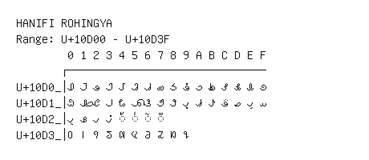

# Hanifi Rohingya

**Range:** `U+10D00` - `U+10D3F`

[← Back to Index](../README.md)

```text
        0 1 2 3 4 5 6 7 8 9 A B C D E F
       ┌───────────────────────────────
U+10D0_│𐴀 𐴁 𐴂 𐴃 𐴄 𐴅 𐴆 𐴇 𐴈 𐴉 𐴊 𐴋 𐴌 𐴍 𐴎 𐴏
U+10D1_│𐴐 𐴑 𐴒 𐴓 𐴔 𐴕 𐴖 𐴗 𐴘 𐴙 𐴚 𐴛 𐴜 𐴝 𐴞 𐴟
U+10D2_│𐴠 𐴡 𐴢 𐴣 ◌𐴤 ◌𐴥 ◌𐴦 ◌𐴧
U+10D3_│𐴰 𐴱 𐴲 𐴳 𐴴 𐴵 𐴶 𐴷 𐴸 𐴹
```

## Visual Fallback Reference
If your system lacks the required fonts to render these characters properly, use the image below as a visual guide.


