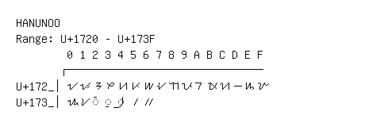

# Hanunoo

**Range:** `U+1720` - `U+173F`

[← Back to Index](../README.md)

```text
        0 1 2 3 4 5 6 7 8 9 A B C D E F
       ┌───────────────────────────────
U+172_│ᜠ ᜡ ᜢ ᜣ ᜤ ᜥ ᜦ ᜧ ᜨ ᜩ ᜪ ᜫ ᜬ ᜭ ᜮ ᜯ
U+173_│ᜰ ᜱ ◌ᜲ ◌ᜳ ◌᜴ ᜵ ᜶
```

## Visual Fallback Reference
If your system lacks the required fonts to render these characters properly, use the image below as a visual guide.


