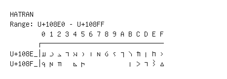

# Hatran

**Range:** `U+108E0` - `U+108FF`

[← Back to Index](../README.md)

```text
        0 1 2 3 4 5 6 7 8 9 A B C D E F
       ┌───────────────────────────────
U+108E_│𐣠 𐣡 𐣢 𐣣 𐣤 𐣥 𐣦 𐣧 𐣨 𐣩 𐣪 𐣫 𐣬 𐣭 𐣮 𐣯
U+108F_│𐣰 𐣱 𐣲   𐣴 𐣵           𐣻 𐣼 𐣽 𐣾 𐣿
```

## Visual Fallback Reference
If your system lacks the required fonts to render these characters properly, use the image below as a visual guide.


