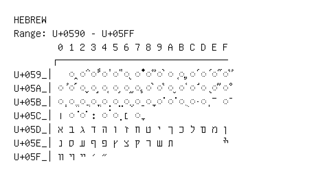

# Hebrew

**Range:** `U+0590` - `U+05FF`

[← Back to Index](../README.md)

```text
        0 1 2 3 4 5 6 7 8 9 A B C D E F
       ┌───────────────────────────────
U+059_│  ◌֑ ◌֒ ◌֓ ◌֔ ◌֕ ◌֖ ◌֗ ◌֘ ◌֙ ◌֚ ◌֛ ◌֜ ◌֝ ◌֞ ◌֟
U+05A_│◌֠ ◌֡ ◌֢ ◌֣ ◌֤ ◌֥ ◌֦ ◌֧ ◌֨ ◌֩ ◌֪ ◌֫ ◌֬ ◌֭ ◌֮ ◌֯
U+05B_│◌ְ ◌ֱ ◌ֲ ◌ֳ ◌ִ ◌ֵ ◌ֶ ◌ַ ◌ָ ◌ֹ ◌ֺ ◌ֻ ◌ּ ◌ֽ ־ ◌ֿ
U+05C_│׀ ◌ׁ ◌ׂ ׃ ◌ׄ ◌ׅ ׆ ◌ׇ
U+05D_│א ב ג ד ה ו ז ח ט י ך כ ל ם מ ן
U+05E_│נ ס ע ף פ ץ צ ק ר ש ת         ׯ
U+05F_│װ ױ ײ ׳ ״
```

## Visual Fallback Reference
If your system lacks the required fonts to render these characters properly, use the image below as a visual guide.


