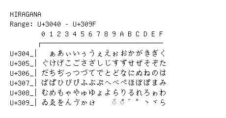

# Hiragana

**Range:** `U+3040` - `U+309F`

[← Back to Index](../README.md)

```text
        0 1 2 3 4 5 6 7 8 9 A B C D E F
       ┌───────────────────────────────
U+304_│  ぁあぃいぅうぇえぉおかがきぎく
U+305_│ぐけげこごさざしじすずせぜそぞた
U+306_│だちぢっつづてでとどなにぬねのは
U+307_│ばぱひびぴふぶぷへべぺほぼぽまみ
U+308_│むめもゃやゅゆょよらりるれろゎわ
U+309_│ゐゑをんゔゕゖ    ◌゙ ◌゚ ゛゜ゝゞゟ
```

## Visual Fallback Reference
If your system lacks the required fonts to render these characters properly, use the image below as a visual guide.


