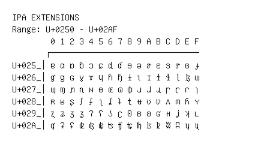

# IPA Extensions

**Range:** `U+0250` - `U+02AF`

[← Back to Index](../README.md)

```text
        0 1 2 3 4 5 6 7 8 9 A B C D E F
       ┌───────────────────────────────
U+025_│ɐ ɑ ɒ ɓ ɔ ɕ ɖ ɗ ɘ ə ɚ ɛ ɜ ɝ ɞ ɟ
U+026_│ɠ ɡ ɢ ɣ ɤ ɥ ɦ ɧ ɨ ɩ ɪ ɫ ɬ ɭ ɮ ɯ
U+027_│ɰ ɱ ɲ ɳ ɴ ɵ ɶ ɷ ɸ ɹ ɺ ɻ ɼ ɽ ɾ ɿ
U+028_│ʀ ʁ ʂ ʃ ʄ ʅ ʆ ʇ ʈ ʉ ʊ ʋ ʌ ʍ ʎ ʏ
U+029_│ʐ ʑ ʒ ʓ ʔ ʕ ʖ ʗ ʘ ʙ ʚ ʛ ʜ ʝ ʞ ʟ
U+02A_│ʠ ʡ ʢ ʣ ʤ ʥ ʦ ʧ ʨ ʩ ʪ ʫ ʬ ʭ ʮ ʯ
```

## Visual Fallback Reference
If your system lacks the required fonts to render these characters properly, use the image below as a visual guide.


