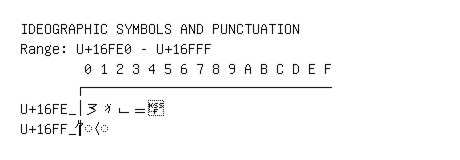

# Ideographic Symbols and Punctuation

**Range:** `U+16FE0` - `U+16FFF`

[← Back to Index](../README.md)

```text
        0 1 2 3 4 5 6 7 8 9 A B C D E F
       ┌───────────────────────────────
U+16FE_│𖿠𖿡𖿢𖿣◌𖿤
U+16FF_│◌𖿰 ◌𖿱
```

## Visual Fallback Reference
If your system lacks the required fonts to render these characters properly, use the image below as a visual guide.


