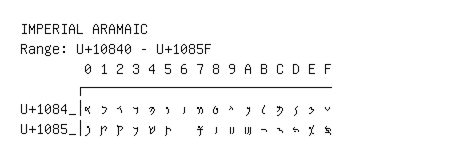

# Imperial Aramaic

**Range:** `U+10840` - `U+1085F`

[← Back to Index](../README.md)

```text
        0 1 2 3 4 5 6 7 8 9 A B C D E F
       ┌───────────────────────────────
U+1084_│𐡀 𐡁 𐡂 𐡃 𐡄 𐡅 𐡆 𐡇 𐡈 𐡉 𐡊 𐡋 𐡌 𐡍 𐡎 𐡏
U+1085_│𐡐 𐡑 𐡒 𐡓 𐡔 𐡕   𐡗 𐡘 𐡙 𐡚 𐡛 𐡜 𐡝 𐡞 𐡟
```

## Visual Fallback Reference
If your system lacks the required fonts to render these characters properly, use the image below as a visual guide.


