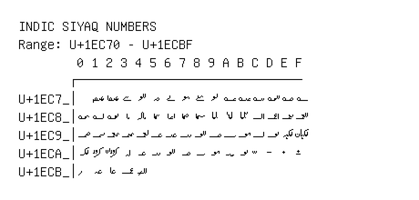

# Indic Siyaq Numbers

**Range:** `U+1EC70` - `U+1ECBF`

[← Back to Index](../README.md)

```text
        0 1 2 3 4 5 6 7 8 9 A B C D E F
       ┌───────────────────────────────
U+1EC7_│  𞱱 𞱲 𞱳 𞱴 𞱵 𞱶 𞱷 𞱸 𞱹 𞱺 𞱻 𞱼 𞱽 𞱾 𞱿
U+1EC8_│𞲀 𞲁 𞲂 𞲃 𞲄 𞲅 𞲆 𞲇 𞲈 𞲉 𞲊 𞲋 𞲌 𞲍 𞲎 𞲏
U+1EC9_│𞲐 𞲑 𞲒 𞲓 𞲔 𞲕 𞲖 𞲗 𞲘 𞲙 𞲚 𞲛 𞲜 𞲝 𞲞 𞲟
U+1ECA_│𞲠 𞲡 𞲢 𞲣 𞲤 𞲥 𞲦 𞲧 𞲨 𞲩 𞲪 𞲫 𞲬 𞲭 𞲮 𞲯
U+1ECB_│𞲰 𞲱 𞲲 𞲳 𞲴
```

## Visual Fallback Reference
If your system lacks the required fonts to render these characters properly, use the image below as a visual guide.


