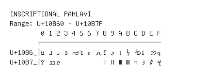

# Inscriptional Pahlavi

**Range:** `U+10B60` - `U+10B7F`

[← Back to Index](../README.md)

```text
        0 1 2 3 4 5 6 7 8 9 A B C D E F
       ┌───────────────────────────────
U+10B6_│𐭠 𐭡 𐭢 𐭣 𐭤 𐭥 𐭦 𐭧 𐭨 𐭩 𐭪 𐭫 𐭬 𐭭 𐭮 𐭯
U+10B7_│𐭰 𐭱 𐭲           𐭸 𐭹 𐭺 𐭻 𐭼 𐭽 𐭾 𐭿
```

## Visual Fallback Reference
If your system lacks the required fonts to render these characters properly, use the image below as a visual guide.


