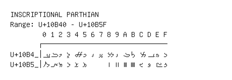

# Inscriptional Parthian

**Range:** `U+10B40` - `U+10B5F`

[← Back to Index](../README.md)

```text
        0 1 2 3 4 5 6 7 8 9 A B C D E F
       ┌───────────────────────────────
U+10B4_│𐭀 𐭁 𐭂 𐭃 𐭄 𐭅 𐭆 𐭇 𐭈 𐭉 𐭊 𐭋 𐭌 𐭍 𐭎 𐭏
U+10B5_│𐭐 𐭑 𐭒 𐭓 𐭔 𐭕     𐭘 𐭙 𐭚 𐭛 𐭜 𐭝 𐭞 𐭟
```

## Visual Fallback Reference
If your system lacks the required fonts to render these characters properly, use the image below as a visual guide.


