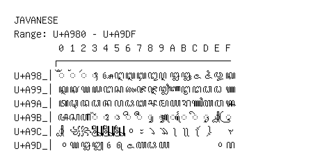

# Javanese

**Range:** `U+A980` - `U+A9DF`

[← Back to Index](../README.md)

```text
        0 1 2 3 4 5 6 7 8 9 A B C D E F
       ┌───────────────────────────────
U+A98_│◌ꦀ ◌ꦁ ◌ꦂ ◌ꦃ ꦄ ꦅ ꦆ ꦇ ꦈ ꦉ ꦊ ꦋ ꦌ ꦍ ꦎ ꦏ
U+A99_│ꦐ ꦑ ꦒ ꦓ ꦔ ꦕ ꦖ ꦗ ꦘ ꦙ ꦚ ꦛ ꦜ ꦝ ꦞ ꦟ
U+A9A_│ꦠ ꦡ ꦢ ꦣ ꦤ ꦥ ꦦ ꦧ ꦨ ꦩ ꦪ ꦫ ꦬ ꦭ ꦮ ꦯ
U+A9B_│ꦰ ꦱ ꦲ ◌꦳ ◌ꦴ ◌ꦵ ◌ꦶ ◌ꦷ ◌ꦸ ◌ꦹ ◌ꦺ ◌ꦻ ◌ꦼ ◌ꦽ ◌ꦾ ◌ꦿ
U+A9C_│◌꧀ ꧁ ꧂ ꧃ ꧄ ꧅ ꧆ ꧇ ꧈ ꧉ ꧊ ꧋ ꧌ ꧍   ꧏ
U+A9D_│꧐ ꧑ ꧒ ꧓ ꧔ ꧕ ꧖ ꧗ ꧘ ꧙         ꧞ ꧟
```

## Visual Fallback Reference
If your system lacks the required fonts to render these characters properly, use the image below as a visual guide.


