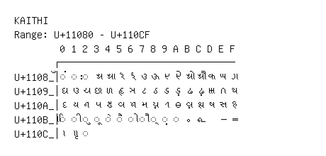

# Kaithi

**Range:** `U+11080` - `U+110CF`

[← Back to Index](../README.md)

```text
        0 1 2 3 4 5 6 7 8 9 A B C D E F
       ┌───────────────────────────────
U+1108_│◌𑂀 ◌𑂁 ◌𑂂 𑂃 𑂄 𑂅 𑂆 𑂇 𑂈 𑂉 𑂊 𑂋 𑂌 𑂍 𑂎 𑂏
U+1109_│𑂐 𑂑 𑂒 𑂓 𑂔 𑂕 𑂖 𑂗 𑂘 𑂙 𑂚 𑂛 𑂜 𑂝 𑂞 𑂟
U+110A_│𑂠 𑂡 𑂢 𑂣 𑂤 𑂥 𑂦 𑂧 𑂨 𑂩 𑂪 𑂫 𑂬 𑂭 𑂮 𑂯
U+110B_│◌𑂰 ◌𑂱 ◌𑂲 ◌𑂳 ◌𑂴 ◌𑂵 ◌𑂶 ◌𑂷 ◌𑂸 ◌𑂹 ◌𑂺 𑂻 𑂼   𑂾 𑂿
U+110C_│𑃀 𑃁 ◌𑃂
```

## Visual Fallback Reference
If your system lacks the required fonts to render these characters properly, use the image below as a visual guide.


