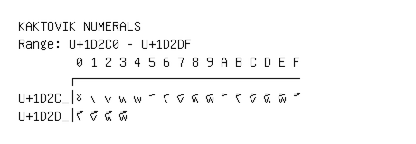

# Kaktovik Numerals

**Range:** `U+1D2C0` - `U+1D2DF`

[← Back to Index](../README.md)

```text
        0 1 2 3 4 5 6 7 8 9 A B C D E F
       ┌───────────────────────────────
U+1D2C_│𝋀 𝋁 𝋂 𝋃 𝋄 𝋅 𝋆 𝋇 𝋈 𝋉 𝋊 𝋋 𝋌 𝋍 𝋎 𝋏
U+1D2D_│𝋐 𝋑 𝋒 𝋓
```

## Visual Fallback Reference
If your system lacks the required fonts to render these characters properly, use the image below as a visual guide.


