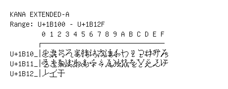

# Kana Extended-A

**Range:** `U+1B100` - `U+1B12F`

[← Back to Index](../README.md)

```text
        0 1 2 3 4 5 6 7 8 9 A B C D E F
       ┌───────────────────────────────
U+1B10_│𛄀𛄁𛄂𛄃𛄄𛄅𛄆𛄇𛄈𛄉𛄊𛄋𛄌𛄍𛄎𛄏
U+1B11_│𛄐𛄑𛄒𛄓𛄔𛄕𛄖𛄗𛄘𛄙𛄚𛄛𛄜𛄝𛄞𛄟
U+1B12_│𛄠𛄡𛄢
```

## Visual Fallback Reference
If your system lacks the required fonts to render these characters properly, use the image below as a visual guide.


