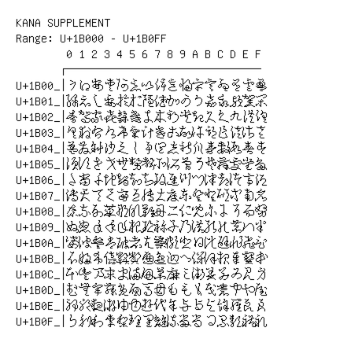

# Kana Supplement

**Range:** `U+1B000` - `U+1B0FF`

[← Back to Index](../README.md)

```text
        0 1 2 3 4 5 6 7 8 9 A B C D E F
       ┌───────────────────────────────
U+1B00_│𛀀𛀁𛀂𛀃𛀄𛀅𛀆𛀇𛀈𛀉𛀊𛀋𛀌𛀍𛀎𛀏
U+1B01_│𛀐𛀑𛀒𛀓𛀔𛀕𛀖𛀗𛀘𛀙𛀚𛀛𛀜𛀝𛀞𛀟
U+1B02_│𛀠𛀡𛀢𛀣𛀤𛀥𛀦𛀧𛀨𛀩𛀪𛀫𛀬𛀭𛀮𛀯
U+1B03_│𛀰𛀱𛀲𛀳𛀴𛀵𛀶𛀷𛀸𛀹𛀺𛀻𛀼𛀽𛀾𛀿
U+1B04_│𛁀𛁁𛁂𛁃𛁄𛁅𛁆𛁇𛁈𛁉𛁊𛁋𛁌𛁍𛁎𛁏
U+1B05_│𛁐𛁑𛁒𛁓𛁔𛁕𛁖𛁗𛁘𛁙𛁚𛁛𛁜𛁝𛁞𛁟
U+1B06_│𛁠𛁡𛁢𛁣𛁤𛁥𛁦𛁧𛁨𛁩𛁪𛁫𛁬𛁭𛁮𛁯
U+1B07_│𛁰𛁱𛁲𛁳𛁴𛁵𛁶𛁷𛁸𛁹𛁺𛁻𛁼𛁽𛁾𛁿
U+1B08_│𛂀𛂁𛂂𛂃𛂄𛂅𛂆𛂇𛂈𛂉𛂊𛂋𛂌𛂍𛂎𛂏
U+1B09_│𛂐𛂑𛂒𛂓𛂔𛂕𛂖𛂗𛂘𛂙𛂚𛂛𛂜𛂝𛂞𛂟
U+1B0A_│𛂠𛂡𛂢𛂣𛂤𛂥𛂦𛂧𛂨𛂩𛂪𛂫𛂬𛂭𛂮𛂯
U+1B0B_│𛂰𛂱𛂲𛂳𛂴𛂵𛂶𛂷𛂸𛂹𛂺𛂻𛂼𛂽𛂾𛂿
U+1B0C_│𛃀𛃁𛃂𛃃𛃄𛃅𛃆𛃇𛃈𛃉𛃊𛃋𛃌𛃍𛃎𛃏
U+1B0D_│𛃐𛃑𛃒𛃓𛃔𛃕𛃖𛃗𛃘𛃙𛃚𛃛𛃜𛃝𛃞𛃟
U+1B0E_│𛃠𛃡𛃢𛃣𛃤𛃥𛃦𛃧𛃨𛃩𛃪𛃫𛃬𛃭𛃮𛃯
U+1B0F_│𛃰𛃱𛃲𛃳𛃴𛃵𛃶𛃷𛃸𛃹𛃺𛃻𛃼𛃽𛃾𛃿
```

## Visual Fallback Reference
If your system lacks the required fonts to render these characters properly, use the image below as a visual guide.


