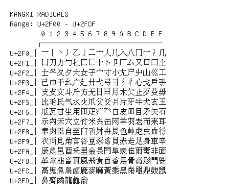

# Kangxi Radicals

**Range:** `U+2F00` - `U+2FDF`

[← Back to Index](../README.md)

```text
        0 1 2 3 4 5 6 7 8 9 A B C D E F
       ┌───────────────────────────────
U+2F0_│⼀⼁⼂⼃⼄⼅⼆⼇⼈⼉⼊⼋⼌⼍⼎⼏
U+2F1_│⼐⼑⼒⼓⼔⼕⼖⼗⼘⼙⼚⼛⼜⼝⼞⼟
U+2F2_│⼠⼡⼢⼣⼤⼥⼦⼧⼨⼩⼪⼫⼬⼭⼮⼯
U+2F3_│⼰⼱⼲⼳⼴⼵⼶⼷⼸⼹⼺⼻⼼⼽⼾⼿
U+2F4_│⽀⽁⽂⽃⽄⽅⽆⽇⽈⽉⽊⽋⽌⽍⽎⽏
U+2F5_│⽐⽑⽒⽓⽔⽕⽖⽗⽘⽙⽚⽛⽜⽝⽞⽟
U+2F6_│⽠⽡⽢⽣⽤⽥⽦⽧⽨⽩⽪⽫⽬⽭⽮⽯
U+2F7_│⽰⽱⽲⽳⽴⽵⽶⽷⽸⽹⽺⽻⽼⽽⽾⽿
U+2F8_│⾀⾁⾂⾃⾄⾅⾆⾇⾈⾉⾊⾋⾌⾍⾎⾏
U+2F9_│⾐⾑⾒⾓⾔⾕⾖⾗⾘⾙⾚⾛⾜⾝⾞⾟
U+2FA_│⾠⾡⾢⾣⾤⾥⾦⾧⾨⾩⾪⾫⾬⾭⾮⾯
U+2FB_│⾰⾱⾲⾳⾴⾵⾶⾷⾸⾹⾺⾻⾼⾽⾾⾿
U+2FC_│⿀⿁⿂⿃⿄⿅⿆⿇⿈⿉⿊⿋⿌⿍⿎⿏
U+2FD_│⿐⿑⿒⿓⿔⿕
```

## Visual Fallback Reference
If your system lacks the required fonts to render these characters properly, use the image below as a visual guide.


