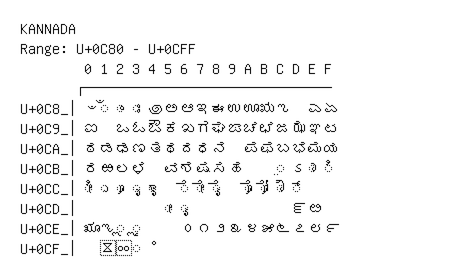

# Kannada

**Range:** `U+0C80` - `U+0CFF`

[← Back to Index](../README.md)

```text
        0 1 2 3 4 5 6 7 8 9 A B C D E F
       ┌───────────────────────────────
U+0C8_│ಀ ◌ಁ ◌ಂ ◌ಃ ಄ ಅ ಆ ಇ ಈ ಉ ಊ ಋ ಌ   ಎ ಏ
U+0C9_│ಐ   ಒ ಓ ಔ ಕ ಖ ಗ ಘ ಙ ಚ ಛ ಜ ಝ ಞ ಟ
U+0CA_│ಠ ಡ ಢ ಣ ತ ಥ ದ ಧ ನ   ಪ ಫ ಬ ಭ ಮ ಯ
U+0CB_│ರ ಱ ಲ ಳ   ವ ಶ ಷ ಸ ಹ     ◌಼ ಽ ◌ಾ ◌ಿ
U+0CC_│◌ೀ ◌ು ◌ೂ ◌ೃ ◌ೄ   ◌ೆ ◌ೇ ◌ೈ   ◌ೊ ◌ೋ ◌ೌ ◌್
U+0CD_│          ◌ೕ ◌ೖ             ೝ ೞ
U+0CE_│ೠ ೡ ◌ೢ ◌ೣ     ೦ ೧ ೨ ೩ ೪ ೫ ೬ ೭ ೮ ೯
U+0CF_│  ೱ ೲ ◌ೳ
```

## Visual Fallback Reference
If your system lacks the required fonts to render these characters properly, use the image below as a visual guide.


