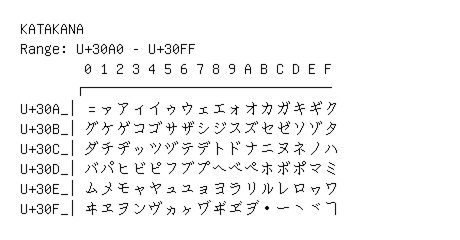

# Katakana

**Range:** `U+30A0` - `U+30FF`

[← Back to Index](../README.md)

```text
        0 1 2 3 4 5 6 7 8 9 A B C D E F
       ┌───────────────────────────────
U+30A_│゠ァアィイゥウェエォオカガキギク
U+30B_│グケゲコゴサザシジスズセゼソゾタ
U+30C_│ダチヂッツヅテデトドナニヌネノハ
U+30D_│バパヒビピフブプヘベペホボポマミ
U+30E_│ムメモャヤュユョヨラリルレロヮワ
U+30F_│ヰヱヲンヴヵヶヷヸヹヺ・ーヽヾヿ
```

## Visual Fallback Reference
If your system lacks the required fonts to render these characters properly, use the image below as a visual guide.


