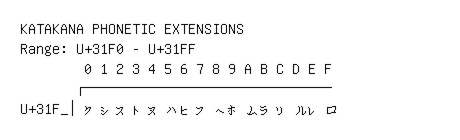

# Katakana Phonetic Extensions

**Range:** `U+31F0` - `U+31FF`

[← Back to Index](../README.md)

```text
        0 1 2 3 4 5 6 7 8 9 A B C D E F
       ┌───────────────────────────────
U+31F_│ㇰㇱㇲㇳㇴㇵㇶㇷㇸㇹㇺㇻㇼㇽㇾㇿ
```

## Visual Fallback Reference
If your system lacks the required fonts to render these characters properly, use the image below as a visual guide.


