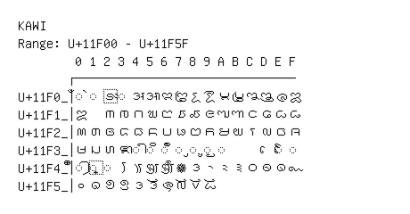

# Kawi

**Range:** `U+11F00` - `U+11F5F`

[← Back to Index](../README.md)

```text
        0 1 2 3 4 5 6 7 8 9 A B C D E F
       ┌───────────────────────────────
U+11F0_│◌𑼀 ◌𑼁 𑼂 ◌𑼃 𑼄 𑼅 𑼆 𑼇 𑼈 𑼉 𑼊 𑼋 𑼌 𑼍 𑼎 𑼏
U+11F1_│𑼐   𑼒 𑼓 𑼔 𑼕 𑼖 𑼗 𑼘 𑼙 𑼚 𑼛 𑼜 𑼝 𑼞 𑼟
U+11F2_│𑼠 𑼡 𑼢 𑼣 𑼤 𑼥 𑼦 𑼧 𑼨 𑼩 𑼪 𑼫 𑼬 𑼭 𑼮 𑼯
U+11F3_│𑼰 𑼱 𑼲 𑼳 ◌𑼴 ◌𑼵 ◌𑼶 ◌𑼷 ◌𑼸 ◌𑼹 ◌𑼺       ◌𑼾 ◌𑼿
U+11F4_│◌𑽀 ◌𑽁 ◌𑽂 𑽃 𑽄 𑽅 𑽆 𑽇 𑽈 𑽉 𑽊 𑽋 𑽌 𑽍 𑽎 𑽏
U+11F5_│𑽐 𑽑 𑽒 𑽓 𑽔 𑽕 𑽖 𑽗 𑽘 𑽙
```

## Visual Fallback Reference
If your system lacks the required fonts to render these characters properly, use the image below as a visual guide.


