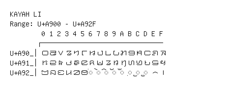

# Kayah Li

**Range:** `U+A900` - `U+A92F`

[← Back to Index](../README.md)

```text
        0 1 2 3 4 5 6 7 8 9 A B C D E F
       ┌───────────────────────────────
U+A90_│꤀ ꤁ ꤂ ꤃ ꤄ ꤅ ꤆ ꤇ ꤈ ꤉ ꤊ ꤋ ꤌ ꤍ ꤎ ꤏ
U+A91_│ꤐ ꤑ ꤒ ꤓ ꤔ ꤕ ꤖ ꤗ ꤘ ꤙ ꤚ ꤛ ꤜ ꤝ ꤞ ꤟ
U+A92_│ꤠ ꤡ ꤢ ꤣ ꤤ ꤥ ◌ꤦ ◌ꤧ ◌ꤨ ◌ꤩ ◌ꤪ ◌꤫ ◌꤬ ◌꤭ ꤮ ꤯
```

## Visual Fallback Reference
If your system lacks the required fonts to render these characters properly, use the image below as a visual guide.


