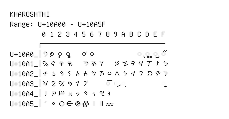

# Kharoshthi

**Range:** `U+10A00` - `U+10A5F`

[← Back to Index](../README.md)

```text
        0 1 2 3 4 5 6 7 8 9 A B C D E F
       ┌───────────────────────────────
U+10A0_│𐨀 ◌𐨁 ◌𐨂 ◌𐨃   ◌𐨅 ◌𐨆           ◌𐨌 ◌𐨍 ◌𐨎 ◌𐨏
U+10A1_│𐨐 𐨑 𐨒 𐨓   𐨕 𐨖 𐨗   𐨙 𐨚 𐨛 𐨜 𐨝 𐨞 𐨟
U+10A2_│𐨠 𐨡 𐨢 𐨣 𐨤 𐨥 𐨦 𐨧 𐨨 𐨩 𐨪 𐨫 𐨬 𐨭 𐨮 𐨯
U+10A3_│𐨰 𐨱 𐨲 𐨳 𐨴 𐨵     ◌𐨸 ◌𐨹 ◌𐨺         ◌𐨿
U+10A4_│𐩀 𐩁 𐩂 𐩃 𐩄 𐩅 𐩆 𐩇 𐩈
U+10A5_│𐩐 𐩑 𐩒 𐩓 𐩔 𐩕 𐩖 𐩗 𐩘
```

## Visual Fallback Reference
If your system lacks the required fonts to render these characters properly, use the image below as a visual guide.


