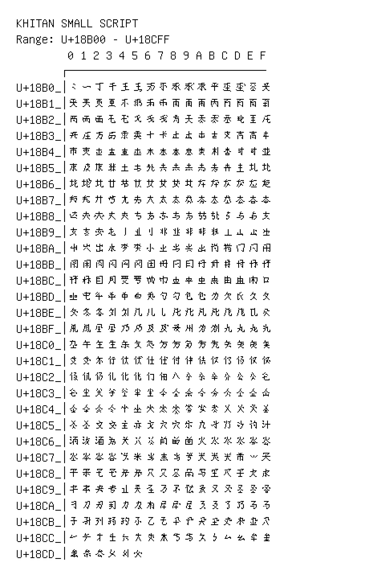

# Khitan Small Script

**Range:** `U+18B00` - `U+18CFF`

[← Back to Index](../README.md)

```text
        0 1 2 3 4 5 6 7 8 9 A B C D E F
       ┌───────────────────────────────
U+18B0_│𘬀𘬁𘬂𘬃𘬄𘬅𘬆𘬇𘬈𘬉𘬊𘬋𘬌𘬍𘬎𘬏
U+18B1_│𘬐𘬑𘬒𘬓𘬔𘬕𘬖𘬗𘬘𘬙𘬚𘬛𘬜𘬝𘬞𘬟
U+18B2_│𘬠𘬡𘬢𘬣𘬤𘬥𘬦𘬧𘬨𘬩𘬪𘬫𘬬𘬭𘬮𘬯
U+18B3_│𘬰𘬱𘬲𘬳𘬴𘬵𘬶𘬷𘬸𘬹𘬺𘬻𘬼𘬽𘬾𘬿
U+18B4_│𘭀𘭁𘭂𘭃𘭄𘭅𘭆𘭇𘭈𘭉𘭊𘭋𘭌𘭍𘭎𘭏
U+18B5_│𘭐𘭑𘭒𘭓𘭔𘭕𘭖𘭗𘭘𘭙𘭚𘭛𘭜𘭝𘭞𘭟
U+18B6_│𘭠𘭡𘭢𘭣𘭤𘭥𘭦𘭧𘭨𘭩𘭪𘭫𘭬𘭭𘭮𘭯
U+18B7_│𘭰𘭱𘭲𘭳𘭴𘭵𘭶𘭷𘭸𘭹𘭺𘭻𘭼𘭽𘭾𘭿
U+18B8_│𘮀𘮁𘮂𘮃𘮄𘮅𘮆𘮇𘮈𘮉𘮊𘮋𘮌𘮍𘮎𘮏
U+18B9_│𘮐𘮑𘮒𘮓𘮔𘮕𘮖𘮗𘮘𘮙𘮚𘮛𘮜𘮝𘮞𘮟
U+18BA_│𘮠𘮡𘮢𘮣𘮤𘮥𘮦𘮧𘮨𘮩𘮪𘮫𘮬𘮭𘮮𘮯
U+18BB_│𘮰𘮱𘮲𘮳𘮴𘮵𘮶𘮷𘮸𘮹𘮺𘮻𘮼𘮽𘮾𘮿
U+18BC_│𘯀𘯁𘯂𘯃𘯄𘯅𘯆𘯇𘯈𘯉𘯊𘯋𘯌𘯍𘯎𘯏
U+18BD_│𘯐𘯑𘯒𘯓𘯔𘯕𘯖𘯗𘯘𘯙𘯚𘯛𘯜𘯝𘯞𘯟
U+18BE_│𘯠𘯡𘯢𘯣𘯤𘯥𘯦𘯧𘯨𘯩𘯪𘯫𘯬𘯭𘯮𘯯
U+18BF_│𘯰𘯱𘯲𘯳𘯴𘯵𘯶𘯷𘯸𘯹𘯺𘯻𘯼𘯽𘯾𘯿
U+18C0_│𘰀𘰁𘰂𘰃𘰄𘰅𘰆𘰇𘰈𘰉𘰊𘰋𘰌𘰍𘰎𘰏
U+18C1_│𘰐𘰑𘰒𘰓𘰔𘰕𘰖𘰗𘰘𘰙𘰚𘰛𘰜𘰝𘰞𘰟
U+18C2_│𘰠𘰡𘰢𘰣𘰤𘰥𘰦𘰧𘰨𘰩𘰪𘰫𘰬𘰭𘰮𘰯
U+18C3_│𘰰𘰱𘰲𘰳𘰴𘰵𘰶𘰷𘰸𘰹𘰺𘰻𘰼𘰽𘰾𘰿
U+18C4_│𘱀𘱁𘱂𘱃𘱄𘱅𘱆𘱇𘱈𘱉𘱊𘱋𘱌𘱍𘱎𘱏
U+18C5_│𘱐𘱑𘱒𘱓𘱔𘱕𘱖𘱗𘱘𘱙𘱚𘱛𘱜𘱝𘱞𘱟
U+18C6_│𘱠𘱡𘱢𘱣𘱤𘱥𘱦𘱧𘱨𘱩𘱪𘱫𘱬𘱭𘱮𘱯
U+18C7_│𘱰𘱱𘱲𘱳𘱴𘱵𘱶𘱷𘱸𘱹𘱺𘱻𘱼𘱽𘱾𘱿
U+18C8_│𘲀𘲁𘲂𘲃𘲄𘲅𘲆𘲇𘲈𘲉𘲊𘲋𘲌𘲍𘲎𘲏
U+18C9_│𘲐𘲑𘲒𘲓𘲔𘲕𘲖𘲗𘲘𘲙𘲚𘲛𘲜𘲝𘲞𘲟
U+18CA_│𘲠𘲡𘲢𘲣𘲤𘲥𘲦𘲧𘲨𘲩𘲪𘲫𘲬𘲭𘲮𘲯
U+18CB_│𘲰𘲱𘲲𘲳𘲴𘲵𘲶𘲷𘲸𘲹𘲺𘲻𘲼𘲽𘲾𘲿
U+18CC_│𘳀𘳁𘳂𘳃𘳄𘳅𘳆𘳇𘳈𘳉𘳊𘳋𘳌𘳍𘳎𘳏
U+18CD_│𘳐𘳑𘳒𘳓𘳔𘳕
```

## Visual Fallback Reference
If your system lacks the required fonts to render these characters properly, use the image below as a visual guide.


