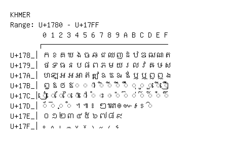

# Khmer

**Range:** `U+1780` - `U+17FF`

[← Back to Index](../README.md)

```text
        0 1 2 3 4 5 6 7 8 9 A B C D E F
       ┌───────────────────────────────
U+178_│ក ខ គ ឃ ង ច ឆ ជ ឈ ញ ដ ឋ ឌ ឍ ណ ត
U+179_│ថ ទ ធ ន ប ផ ព ភ ម យ រ ល វ ឝ ឞ ស
U+17A_│ហ ឡ អ ឣ ឤ ឥ ឦ ឧ ឨ ឩ ឪ ឫ ឬ ឭ ឮ ឯ
U+17B_│ឰ ឱ ឲ ឳ ◌឴ ◌឵ ◌ា ◌ិ ◌ី ◌ឹ ◌ឺ ◌ុ ◌ូ ◌ួ ◌ើ ◌ឿ
U+17C_│◌ៀ ◌េ ◌ែ ◌ៃ ◌ោ ◌ៅ ◌ំ ◌ះ ◌ៈ ◌៉ ◌៊ ◌់ ◌៌ ◌៍ ◌៎ ◌៏
U+17D_│◌័ ◌៑ ◌្ ◌៓ ។ ៕ ៖ ៗ ៘ ៙ ៚ ៛ ៜ ◌៝
U+17E_│០ ១ ២ ៣ ៤ ៥ ៦ ៧ ៨ ៩
U+17F_│៰ ៱ ៲ ៳ ៴ ៵ ៶ ៷ ៸ ៹
```

## Visual Fallback Reference
If your system lacks the required fonts to render these characters properly, use the image below as a visual guide.


