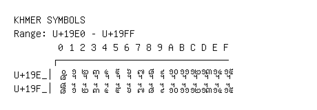

# Khmer Symbols

**Range:** `U+19E0` - `U+19FF`

[← Back to Index](../README.md)

```text
        0 1 2 3 4 5 6 7 8 9 A B C D E F
       ┌───────────────────────────────
U+19E_│᧠ ᧡ ᧢ ᧣ ᧤ ᧥ ᧦ ᧧ ᧨ ᧩ ᧪ ᧫ ᧬ ᧭ ᧮ ᧯
U+19F_│᧰ ᧱ ᧲ ᧳ ᧴ ᧵ ᧶ ᧷ ᧸ ᧹ ᧺ ᧻ ᧼ ᧽ ᧾ ᧿
```

## Visual Fallback Reference
If your system lacks the required fonts to render these characters properly, use the image below as a visual guide.


