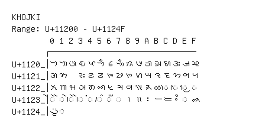

# Khojki

**Range:** `U+11200` - `U+1124F`

[← Back to Index](../README.md)

```text
        0 1 2 3 4 5 6 7 8 9 A B C D E F
       ┌───────────────────────────────
U+1120_│𑈀 𑈁 𑈂 𑈃 𑈄 𑈅 𑈆 𑈇 𑈈 𑈉 𑈊 𑈋 𑈌 𑈍 𑈎 𑈏
U+1121_│𑈐 𑈑   𑈓 𑈔 𑈕 𑈖 𑈗 𑈘 𑈙 𑈚 𑈛 𑈜 𑈝 𑈞 𑈟
U+1122_│𑈠 𑈡 𑈢 𑈣 𑈤 𑈥 𑈦 𑈧 𑈨 𑈩 𑈪 𑈫 ◌𑈬 ◌𑈭 ◌𑈮 ◌𑈯
U+1123_│◌𑈰 ◌𑈱 ◌𑈲 ◌𑈳 ◌𑈴 ◌𑈵 ◌𑈶 ◌𑈷 𑈸 𑈹 𑈺 𑈻 𑈼 𑈽 ◌𑈾 𑈿
U+1124_│𑉀 ◌𑉁
```

## Visual Fallback Reference
If your system lacks the required fonts to render these characters properly, use the image below as a visual guide.


