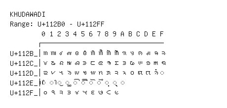

# Khudawadi

**Range:** `U+112B0` - `U+112FF`

[← Back to Index](../README.md)

```text
        0 1 2 3 4 5 6 7 8 9 A B C D E F
       ┌───────────────────────────────
U+112B_│𑊰 𑊱 𑊲 𑊳 𑊴 𑊵 𑊶 𑊷 𑊸 𑊹 𑊺 𑊻 𑊼 𑊽 𑊾 𑊿
U+112C_│𑋀 𑋁 𑋂 𑋃 𑋄 𑋅 𑋆 𑋇 𑋈 𑋉 𑋊 𑋋 𑋌 𑋍 𑋎 𑋏
U+112D_│𑋐 𑋑 𑋒 𑋓 𑋔 𑋕 𑋖 𑋗 𑋘 𑋙 𑋚 𑋛 𑋜 𑋝 𑋞 ◌𑋟
U+112E_│◌𑋠 ◌𑋡 ◌𑋢 ◌𑋣 ◌𑋤 ◌𑋥 ◌𑋦 ◌𑋧 ◌𑋨 ◌𑋩 ◌𑋪
U+112F_│𑋰 𑋱 𑋲 𑋳 𑋴 𑋵 𑋶 𑋷 𑋸 𑋹
```

## Visual Fallback Reference
If your system lacks the required fonts to render these characters properly, use the image below as a visual guide.


