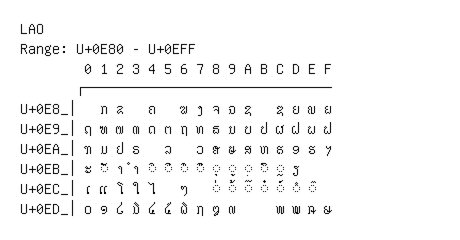

# Lao

**Range:** `U+0E80` - `U+0EFF`

[← Back to Index](../README.md)

```text
        0 1 2 3 4 5 6 7 8 9 A B C D E F
       ┌───────────────────────────────
U+0E8_│  ກ ຂ   ຄ   ຆ ງ ຈ ຉ ຊ   ຌ ຍ ຎ ຏ
U+0E9_│ຐ ຑ ຒ ຓ ດ ຕ ຖ ທ ຘ ນ ບ ປ ຜ ຝ ພ ຟ
U+0EA_│ຠ ມ ຢ ຣ   ລ   ວ ຨ ຩ ສ ຫ ຬ ອ ຮ ຯ
U+0EB_│ະ ◌ັ າ ຳ ◌ິ ◌ີ ◌ຶ ◌ື ◌ຸ ◌ູ ◌຺ ◌ົ ◌ຼ ຽ
U+0EC_│ເ ແ ໂ ໃ ໄ   ໆ   ◌່ ◌້ ◌໊ ◌໋ ◌໌ ◌ໍ ◌໎
U+0ED_│໐ ໑ ໒ ໓ ໔ ໕ ໖ ໗ ໘ ໙     ໜ ໝ ໞ ໟ
```

## Visual Fallback Reference
If your system lacks the required fonts to render these characters properly, use the image below as a visual guide.


