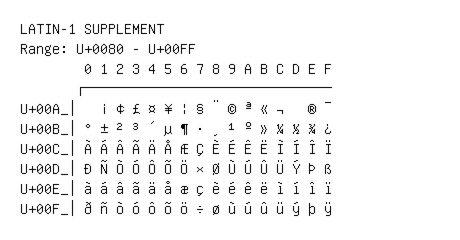

# Latin-1 Supplement

**Range:** `U+0080` - `U+00FF`

[← Back to Index](../README.md)

```text
        0 1 2 3 4 5 6 7 8 9 A B C D E F
       ┌───────────────────────────────
U+00A_│  ¡ ¢ £ ¤ ¥ ¦ § ¨ © ª « ¬   ® ¯
U+00B_│° ± ² ³ ´ µ ¶ · ¸ ¹ º » ¼ ½ ¾ ¿
U+00C_│À Á Â Ã Ä Å Æ Ç È É Ê Ë Ì Í Î Ï
U+00D_│Ð Ñ Ò Ó Ô Õ Ö × Ø Ù Ú Û Ü Ý Þ ß
U+00E_│à á â ã ä å æ ç è é ê ë ì í î ï
U+00F_│ð ñ ò ó ô õ ö ÷ ø ù ú û ü ý þ ÿ
```

## Visual Fallback Reference
If your system lacks the required fonts to render these characters properly, use the image below as a visual guide.


