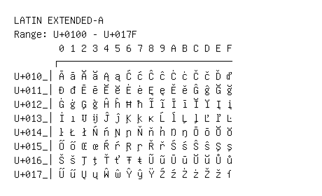

# Latin Extended-A

**Range:** `U+0100` - `U+017F`

[← Back to Index](../README.md)

```text
        0 1 2 3 4 5 6 7 8 9 A B C D E F
       ┌───────────────────────────────
U+010_│Ā ā Ă ă Ą ą Ć ć Ĉ ĉ Ċ ċ Č č Ď ď
U+011_│Đ đ Ē ē Ĕ ĕ Ė ė Ę ę Ě ě Ĝ ĝ Ğ ğ
U+012_│Ġ ġ Ģ ģ Ĥ ĥ Ħ ħ Ĩ ĩ Ī ī Ĭ ĭ Į į
U+013_│İ ı IJ ij Ĵ ĵ Ķ ķ ĸ Ĺ ĺ Ļ ļ Ľ ľ Ŀ
U+014_│ŀ Ł ł Ń ń Ņ ņ Ň ň ʼn Ŋ ŋ Ō ō Ŏ ŏ
U+015_│Ő ő Œ œ Ŕ ŕ Ŗ ŗ Ř ř Ś ś Ŝ ŝ Ş ş
U+016_│Š š Ţ ţ Ť ť Ŧ ŧ Ũ ũ Ū ū Ŭ ŭ Ů ů
U+017_│Ű ű Ų ų Ŵ ŵ Ŷ ŷ Ÿ Ź ź Ż ż Ž ž ſ
```

## Visual Fallback Reference
If your system lacks the required fonts to render these characters properly, use the image below as a visual guide.


