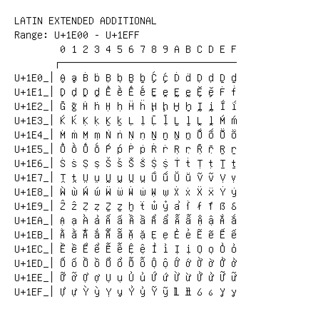

# Latin Extended Additional

**Range:** `U+1E00` - `U+1EFF`

[← Back to Index](../README.md)

```text
        0 1 2 3 4 5 6 7 8 9 A B C D E F
       ┌───────────────────────────────
U+1E0_│Ḁ ḁ Ḃ ḃ Ḅ ḅ Ḇ ḇ Ḉ ḉ Ḋ ḋ Ḍ ḍ Ḏ ḏ
U+1E1_│Ḑ ḑ Ḓ ḓ Ḕ ḕ Ḗ ḗ Ḙ ḙ Ḛ ḛ Ḝ ḝ Ḟ ḟ
U+1E2_│Ḡ ḡ Ḣ ḣ Ḥ ḥ Ḧ ḧ Ḩ ḩ Ḫ ḫ Ḭ ḭ Ḯ ḯ
U+1E3_│Ḱ ḱ Ḳ ḳ Ḵ ḵ Ḷ ḷ Ḹ ḹ Ḻ ḻ Ḽ ḽ Ḿ ḿ
U+1E4_│Ṁ ṁ Ṃ ṃ Ṅ ṅ Ṇ ṇ Ṉ ṉ Ṋ ṋ Ṍ ṍ Ṏ ṏ
U+1E5_│Ṑ ṑ Ṓ ṓ Ṕ ṕ Ṗ ṗ Ṙ ṙ Ṛ ṛ Ṝ ṝ Ṟ ṟ
U+1E6_│Ṡ ṡ Ṣ ṣ Ṥ ṥ Ṧ ṧ Ṩ ṩ Ṫ ṫ Ṭ ṭ Ṯ ṯ
U+1E7_│Ṱ ṱ Ṳ ṳ Ṵ ṵ Ṷ ṷ Ṹ ṹ Ṻ ṻ Ṽ ṽ Ṿ ṿ
U+1E8_│Ẁ ẁ Ẃ ẃ Ẅ ẅ Ẇ ẇ Ẉ ẉ Ẋ ẋ Ẍ ẍ Ẏ ẏ
U+1E9_│Ẑ ẑ Ẓ ẓ Ẕ ẕ ẖ ẗ ẘ ẙ ẚ ẛ ẜ ẝ ẞ ẟ
U+1EA_│Ạ ạ Ả ả Ấ ấ Ầ ầ Ẩ ẩ Ẫ ẫ Ậ ậ Ắ ắ
U+1EB_│Ằ ằ Ẳ ẳ Ẵ ẵ Ặ ặ Ẹ ẹ Ẻ ẻ Ẽ ẽ Ế ế
U+1EC_│Ề ề Ể ể Ễ ễ Ệ ệ Ỉ ỉ Ị ị Ọ ọ Ỏ ỏ
U+1ED_│Ố ố Ồ ồ Ổ ổ Ỗ ỗ Ộ ộ Ớ ớ Ờ ờ Ở ở
U+1EE_│Ỡ ỡ Ợ ợ Ụ ụ Ủ ủ Ứ ứ Ừ ừ Ử ử Ữ ữ
U+1EF_│Ự ự Ỳ ỳ Ỵ ỵ Ỷ ỷ Ỹ ỹ Ỻ ỻ Ỽ ỽ Ỿ ỿ
```

## Visual Fallback Reference
If your system lacks the required fonts to render these characters properly, use the image below as a visual guide.


