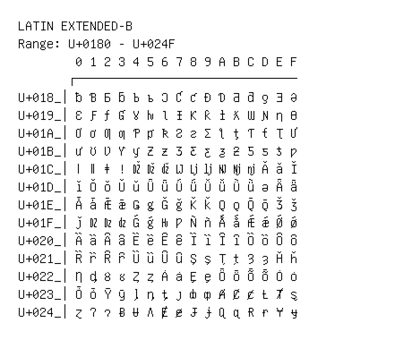

# Latin Extended-B

**Range:** `U+0180` - `U+024F`

[← Back to Index](../README.md)

```text
        0 1 2 3 4 5 6 7 8 9 A B C D E F
       ┌───────────────────────────────
U+018_│ƀ Ɓ Ƃ ƃ Ƅ ƅ Ɔ Ƈ ƈ Ɖ Ɗ Ƌ ƌ ƍ Ǝ Ə
U+019_│Ɛ Ƒ ƒ Ɠ Ɣ ƕ Ɩ Ɨ Ƙ ƙ ƚ ƛ Ɯ Ɲ ƞ Ɵ
U+01A_│Ơ ơ Ƣ ƣ Ƥ ƥ Ʀ Ƨ ƨ Ʃ ƪ ƫ Ƭ ƭ Ʈ Ư
U+01B_│ư Ʊ Ʋ Ƴ ƴ Ƶ ƶ Ʒ Ƹ ƹ ƺ ƻ Ƽ ƽ ƾ ƿ
U+01C_│ǀ ǁ ǂ ǃ DŽ Dž dž LJ Lj lj NJ Nj nj Ǎ ǎ Ǐ
U+01D_│ǐ Ǒ ǒ Ǔ ǔ Ǖ ǖ Ǘ ǘ Ǚ ǚ Ǜ ǜ ǝ Ǟ ǟ
U+01E_│Ǡ ǡ Ǣ ǣ Ǥ ǥ Ǧ ǧ Ǩ ǩ Ǫ ǫ Ǭ ǭ Ǯ ǯ
U+01F_│ǰ DZ Dz dz Ǵ ǵ Ƕ Ƿ Ǹ ǹ Ǻ ǻ Ǽ ǽ Ǿ ǿ
U+020_│Ȁ ȁ Ȃ ȃ Ȅ ȅ Ȇ ȇ Ȉ ȉ Ȋ ȋ Ȍ ȍ Ȏ ȏ
U+021_│Ȑ ȑ Ȓ ȓ Ȕ ȕ Ȗ ȗ Ș ș Ț ț Ȝ ȝ Ȟ ȟ
U+022_│Ƞ ȡ Ȣ ȣ Ȥ ȥ Ȧ ȧ Ȩ ȩ Ȫ ȫ Ȭ ȭ Ȯ ȯ
U+023_│Ȱ ȱ Ȳ ȳ ȴ ȵ ȶ ȷ ȸ ȹ Ⱥ Ȼ ȼ Ƚ Ⱦ ȿ
U+024_│ɀ Ɂ ɂ Ƀ Ʉ Ʌ Ɇ ɇ Ɉ ɉ Ɋ ɋ Ɍ ɍ Ɏ ɏ
```

## Visual Fallback Reference
If your system lacks the required fonts to render these characters properly, use the image below as a visual guide.


