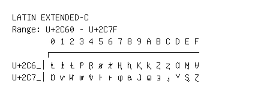

# Latin Extended-C

**Range:** `U+2C60` - `U+2C7F`

[← Back to Index](../README.md)

```text
        0 1 2 3 4 5 6 7 8 9 A B C D E F
       ┌───────────────────────────────
U+2C6_│Ⱡ ⱡ Ɫ Ᵽ Ɽ ⱥ ⱦ Ⱨ ⱨ Ⱪ ⱪ Ⱬ ⱬ Ɑ Ɱ Ɐ
U+2C7_│Ɒ ⱱ Ⱳ ⱳ ⱴ Ⱶ ⱶ ⱷ ⱸ ⱹ ⱺ ⱻ ⱼ ⱽ Ȿ Ɀ
```

## Visual Fallback Reference
If your system lacks the required fonts to render these characters properly, use the image below as a visual guide.


