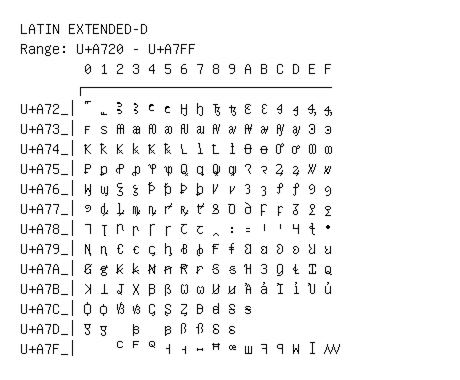

# Latin Extended-D

**Range:** `U+A720` - `U+A7FF`

[← Back to Index](../README.md)

```text
        0 1 2 3 4 5 6 7 8 9 A B C D E F
       ┌───────────────────────────────
U+A72_│꜠ ꜡ Ꜣ ꜣ Ꜥ ꜥ Ꜧ ꜧ Ꜩ ꜩ Ꜫ ꜫ Ꜭ ꜭ Ꜯ ꜯ
U+A73_│ꜰ ꜱ Ꜳ ꜳ Ꜵ ꜵ Ꜷ ꜷ Ꜹ ꜹ Ꜻ ꜻ Ꜽ ꜽ Ꜿ ꜿ
U+A74_│Ꝁ ꝁ Ꝃ ꝃ Ꝅ ꝅ Ꝇ ꝇ Ꝉ ꝉ Ꝋ ꝋ Ꝍ ꝍ Ꝏ ꝏ
U+A75_│Ꝑ ꝑ Ꝓ ꝓ Ꝕ ꝕ Ꝗ ꝗ Ꝙ ꝙ Ꝛ ꝛ Ꝝ ꝝ Ꝟ ꝟ
U+A76_│Ꝡ ꝡ Ꝣ ꝣ Ꝥ ꝥ Ꝧ ꝧ Ꝩ ꝩ Ꝫ ꝫ Ꝭ ꝭ Ꝯ ꝯ
U+A77_│ꝰ ꝱ ꝲ ꝳ ꝴ ꝵ ꝶ ꝷ ꝸ Ꝺ ꝺ Ꝼ ꝼ Ᵹ Ꝿ ꝿ
U+A78_│Ꞁ ꞁ Ꞃ ꞃ Ꞅ ꞅ Ꞇ ꞇ ꞈ ꞉ ꞊ Ꞌ ꞌ Ɥ ꞎ ꞏ
U+A79_│Ꞑ ꞑ Ꞓ ꞓ ꞔ ꞕ Ꞗ ꞗ Ꞙ ꞙ Ꞛ ꞛ Ꞝ ꞝ Ꞟ ꞟ
U+A7A_│Ꞡ ꞡ Ꞣ ꞣ Ꞥ ꞥ Ꞧ ꞧ Ꞩ ꞩ Ɦ Ɜ Ɡ Ɬ Ɪ ꞯ
U+A7B_│Ʞ Ʇ Ʝ Ꭓ Ꞵ ꞵ Ꞷ ꞷ Ꞹ ꞹ Ꞻ ꞻ Ꞽ ꞽ Ꞿ ꞿ
U+A7C_│Ꟁ ꟁ Ꟃ ꟃ Ꞔ Ʂ Ᶎ Ꟈ ꟈ Ꟊ ꟊ
U+A7D_│Ꟑ ꟑ   ꟓ   ꟕ Ꟗ ꟗ Ꟙ ꟙ
U+A7F_│    ꟲ ꟳ ꟴ Ꟶ ꟶ ꟷ ꟸ ꟹ ꟺ ꟻ ꟼ ꟽ ꟾ ꟿ
```

## Visual Fallback Reference
If your system lacks the required fonts to render these characters properly, use the image below as a visual guide.


