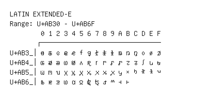

# Latin Extended-E

**Range:** `U+AB30` - `U+AB6F`

[← Back to Index](../README.md)

```text
        0 1 2 3 4 5 6 7 8 9 A B C D E F
       ┌───────────────────────────────
U+AB3_│ꬰ ꬱ ꬲ ꬳ ꬴ ꬵ ꬶ ꬷ ꬸ ꬹ ꬺ ꬻ ꬼ ꬽ ꬾ ꬿ
U+AB4_│ꭀ ꭁ ꭂ ꭃ ꭄ ꭅ ꭆ ꭇ ꭈ ꭉ ꭊ ꭋ ꭌ ꭍ ꭎ ꭏ
U+AB5_│ꭐ ꭑ ꭒ ꭓ ꭔ ꭕ ꭖ ꭗ ꭘ ꭙ ꭚ ꭛ ꭜ ꭝ ꭞ ꭟ
U+AB6_│ꭠ ꭡ ꭢ ꭣ ꭤ ꭥ ꭦ ꭧ ꭨ ꭩ ꭪ ꭫
```

## Visual Fallback Reference
If your system lacks the required fonts to render these characters properly, use the image below as a visual guide.


