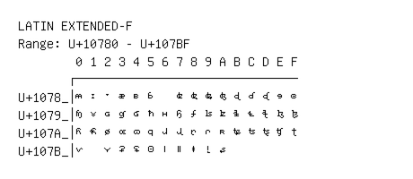

# Latin Extended-F

**Range:** `U+10780` - `U+107BF`

[← Back to Index](../README.md)

```text
        0 1 2 3 4 5 6 7 8 9 A B C D E F
       ┌───────────────────────────────
U+1078_│𐞀 𐞁 𐞂 𐞃 𐞄 𐞅   𐞇 𐞈 𐞉 𐞊 𐞋 𐞌 𐞍 𐞎 𐞏
U+1079_│𐞐 𐞑 𐞒 𐞓 𐞔 𐞕 𐞖 𐞗 𐞘 𐞙 𐞚 𐞛 𐞜 𐞝 𐞞 𐞟
U+107A_│𐞠 𐞡 𐞢 𐞣 𐞤 𐞥 𐞦 𐞧 𐞨 𐞩 𐞪 𐞫 𐞬 𐞭 𐞮 𐞯
U+107B_│𐞰   𐞲 𐞳 𐞴 𐞵 𐞶 𐞷 𐞸 𐞹 𐞺
```

## Visual Fallback Reference
If your system lacks the required fonts to render these characters properly, use the image below as a visual guide.


