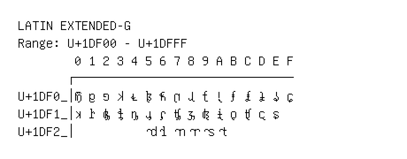

# Latin Extended-G

**Range:** `U+1DF00` - `U+1DFFF`

[← Back to Index](../README.md)

```text
        0 1 2 3 4 5 6 7 8 9 A B C D E F
       ┌───────────────────────────────
U+1DF0_│𝼀 𝼁 𝼂 𝼃 𝼄 𝼅 𝼆 𝼇 𝼈 𝼉 𝼊 𝼋 𝼌 𝼍 𝼎 𝼏
U+1DF1_│𝼐 𝼑 𝼒 𝼓 𝼔 𝼕 𝼖 𝼗 𝼘 𝼙 𝼚 𝼛 𝼜 𝼝 𝼞
U+1DF2_│          𝼥 𝼦 𝼧 𝼨 𝼩 𝼪
```

## Visual Fallback Reference
If your system lacks the required fonts to render these characters properly, use the image below as a visual guide.


